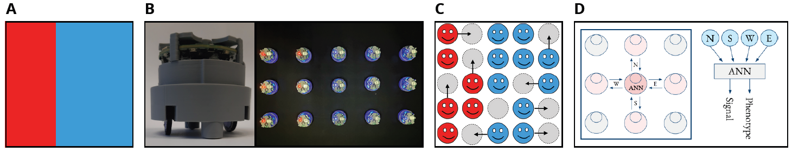

# SwarmAdaptivePattern_GECCO25
This project implements the evolutionary algorithm **CMA-ES to evolve the optimal robot controller** (D), enabling each robot of a swarm to **reproduce a phenotypic pattern** at the group scale, matching the **visual display target** (A). The swarm of **moving robots** is modeled in an original **sliding-puzzle setup** (C) — a grid where each cell can either be occupied by an autonomous robot or remain empty. This **distributed system** is characterized by two parameters: **density**, which refers to the number of robots relative to the total available positions in the grid; and **fluidity**, which represents the probability of an agent moving to a nearby empty position at each time step. **Communication between robots is local**, occurring through **signal exchanges** in a **neighbor-to-neighbor von Neumann topology** (D).

> **To cite this work** (BibTeX):  
  @inproceedings{Loi2025,  
  author    = {Alessia Loi and Nicolas Bredeche},  
  title     = {Evolving Neural Controllers for Adaptive Visual Pattern Formation by a Swarm of Robots},  
  booktitle = {Proceedings of GECCO 2025 @ Málaga (hybrid), The Genetic and Evolutionary Computation Conference (GECCO '25)},  
  year      = {2025},  
  publisher = {ACM},  
  address   = {New York, NY, USA},  
  pages     = {1--9}  
}

> **Acknowledgement**: This work is supported by the Agence Nationale pour la Recherche under Grant ANR-24-CE33-7791

## **To run an experiment: Learning, Swarm (generalization), and Plots**

-   Set the learning and generalization parameters by modifying **learning_params.json** and **swarm_params.json**. The parameters are already settled to reproduce the paper results.
-   In the Bash script **launch.sh**, uncomment the lines that you wish to run. If you run **learning_main.py** only, you can later execute **swarm_main.py** or the analysis scripts by commenting out **learning_main.py** and filling the **learning_analysis_dir** and **swarm_analysis_dir** fields.
-   From the *src* directory, execute the Bash script **launch.sh**:
    `~/SwarmAdaptivePattern_GECCO25/src$ ./launch.sh` 
-   The results will be stored in a newly created **simulationAnalysis** folder.

## Details
- In the function **plot_flag** in **environments.py**: the plot of the signal pattern does not work for **grid_nb_rows** ≤ 10 and **grid_nb_cols** ≤ 10 because signal values can be negative. **Easy fix**: comment out the special debug display for small grids.
- To reproduce the paper results, set:
  - "env_name": "sliding_puzzle_incremental"
  - "sliding_puzzle_incremental_switch_eval": 0
  - "sliding_puzzle_incremental_nb_deletions_units": null
  - "sliding_puzzle_incremental_nb_deletions_percent": [0.0, X], where X is the complement of density (i.e., 1.0 - density).
- In **learning_params.json**, the parameter **sliding_puzzle_incremental_nb_deletions_percent** corresponds to the complement of density (1.0 - density).
  Example 1: If density = 1.0 (meaning all grid positions are occupied by robots), then sliding_puzzle_incremental_nb_deletions_percent = 0.0.
  Example 2: If density = 0.8 (meaning 20% of the grid positions are empty), then sliding_puzzle_incremental_nb_deletions_percent = 0.2.
